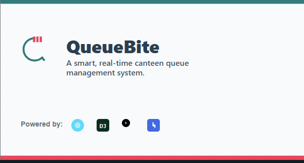

<div align="center">

<h1>QueueBite</h1>
<p><b>Order ahead, skip the line, and enjoy your meal! 🍔</b></p>
<p>


</p>
---
</div>

## 🚀 Overview
QueueBite is a real-time, smart queue management system designed to eliminate long waits and streamline the canteen experience at colleges and corporate offices. It allows users to place food orders from their devices, receive a digital token, and get notified when their meal is ready for pickup.  
This system empowers canteen owners to manage incoming orders efficiently through a live dashboard, improving overall workflow and customer satisfaction.

---

## ✨ Key Features

### For Customers
- 📱 **Mobile-First Ordering:** Responsive UI to easily browse the menu and place orders.
- 🔄 **Real-Time Queue Updates:** See the live status of your order without refreshing the page.
- 🎟️ **Digital Tokens:** Receive a unique digital token for every order.
- 🔔 **Pickup Notifications:** Get notified the moment your order is marked as "Ready".
- 👤 **User Profiles:** Track order history and manage your profile.

### For Canteen Staff/Admin
- 🧑‍🍳 **Live Order Dashboard:** View and manage all incoming orders in a Kanban-style interface ("Pending", "In Progress", "Ready").
- 📊 **Dashboard Analytics:** Get insights into sales, peak hours, and most popular items.
- ⚙️ **Menu Management:** Easily add, update, or remove food items from the menu.
- 🔐 **Role-Based Access:** Secure login for staff members with specific permissions.

---

## 🛠️ Technology Stack

| Frontend | Backend | Real-Time |
|----------|---------|-----------|
| React.js | Django  | Socket.IO |
| TailwindCSS | Django REST Framework | Redis |
| Axios | PostgreSQL | WebSockets |

---

## ⚙️ Getting Started

To get a local copy up and running, follow these simple steps.

### **Prerequisites**
- Python 3.10+
- Node.js v18+ & npm
- PostgreSQL & Redis installed and running

---

### **Installation**

#### 1️⃣ Clone the repository
```bash
git clone https://github.com/your-username/queuebite.git
cd queuebite

cd backend
python -m venv venv
source venv/bin/activate  # On Windows: venv\Scripts\activate
pip install -r requirements.txt
python manage.py migrate
python manage.py runserver

cd ../frontend
npm install
npm run dev
```
🔄 System Flow
```bash
1. Customer logs in and places an order via the React frontend.
      │
      └─> API Request to Django (POST /api/orders/place/)
            │
            ├─> 2. Django saves the order to the PostgreSQL database.
            │
            └─> 3. Django emits a 'new_order' event via Socket.IO.
                  │
                  ├─> 4. Canteen Staff Dashboard instantly receives the event and displays the new order.
                  │
                  └─> 5. All connected Customers see the live queue update with the new token.

When staff updates the order status, steps 3–5 are repeated for the 'order_update' event.
```

📜 License
This project is licensed under the MIT License - see the LICENSE file for details.
